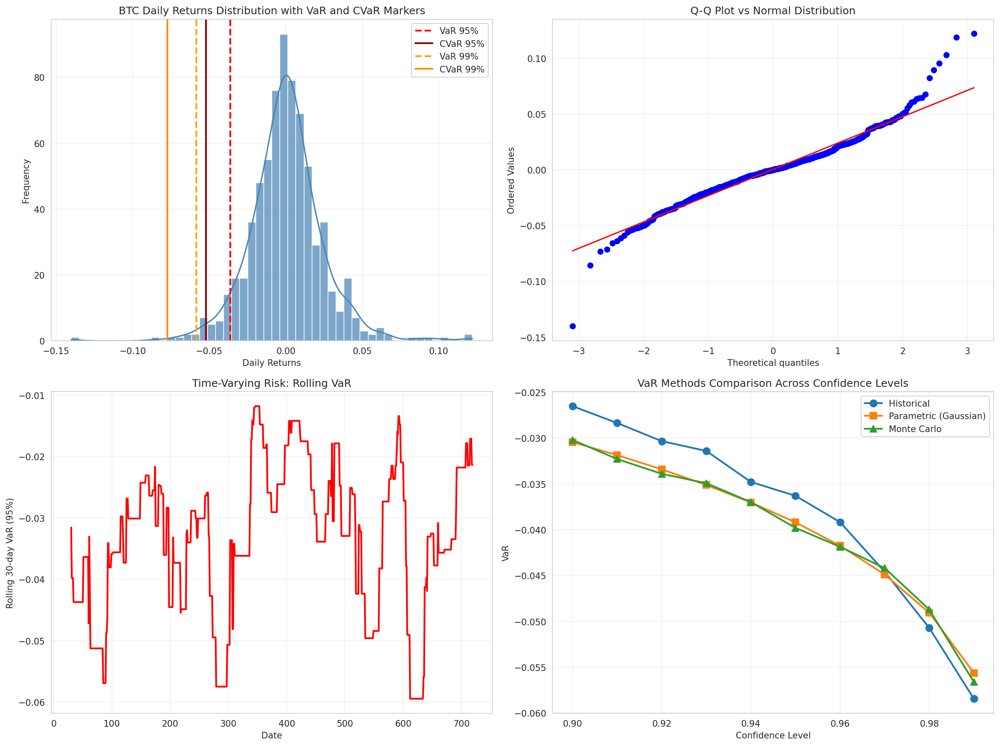
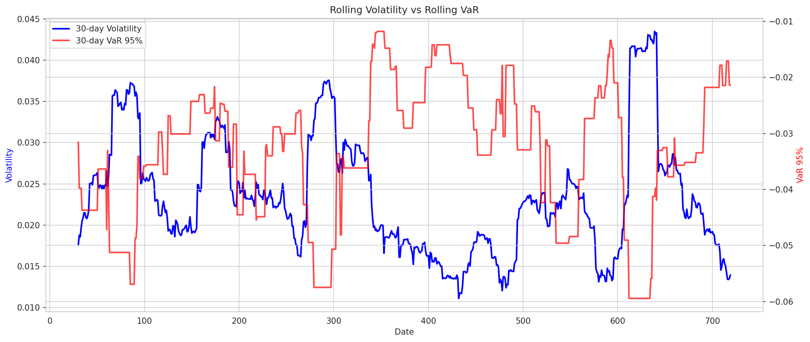
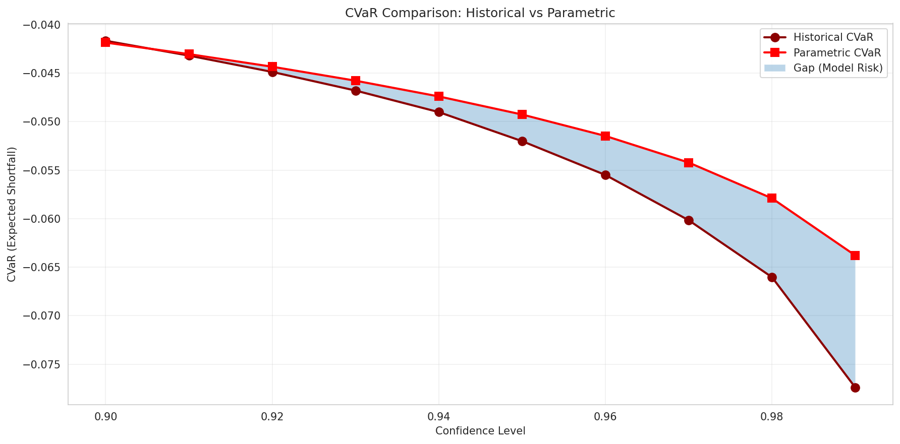

# Semaine 19 - VaR et CVaR (Value at Risk & Conditional Value at Risk)

**Date:** 24 Mai 2026  
**Niveau:** Master 4 - Risk Management Advanced  
**Temps estimé:** 3-4h

---

## 🎯 Objectifs du Module

1. Comprendre et calculer la **Value at Risk (VaR)**
2. Maîtriser le **Conditional VaR (CVaR / Expected Shortfall)**
3. Implémenter 3 méthodes de calcul: Historique, Paramétrique, Monte Carlo
4. Appliquer sur données réelles BTC
5. Visualiser les distributions avec markers VaR/CVaR

---

## 📚 Théorie Fondamentale

### 1. Value at Risk (VaR)

**Définition:**
> La VaR est la perte maximale attendue sur un horizon donné, avec un niveau de confiance spécifié.

**Formellement:**
```
P(Loss > VaR_α) = 1 - α

Où:
- α = niveau de confiance (95%, 99%, etc.)
- Horizon = 1 jour (typiquement)
```

**Exemple:**
- VaR 95% = -3.63%
- Signification: "Il y a 95% de chance que la perte quotidienne ne dépasse pas 3.63%"
- Ou: "Dans 5% des cas (1 jour sur 20), on perd PLUS que 3.63%"

### 2. Conditional VaR (CVaR / Expected Shortfall)

**Définition:**
> Le CVaR est la perte **moyenne** attendue **quand on dépasse la VaR**.

**Aussi appelé:**
- Expected Shortfall (ES)
- Average Value at Risk (AVaR)
- Tail VaR

**Formellement:**
```
CVaR_α = E[Loss | Loss > VaR_α]
```

**Pourquoi CVaR est meilleur que VaR:**

| Problème | VaR | CVaR |
|----------|-----|------|
| Ignore la queue de distribution | ❌ | ✅ |
| Non cohérent (subadditivity) | ❌ | ✅ |
| Capture les événements extrêmes | ❌ | ✅ |
| Convexe (optimisation facile) | ❌ | ✅ |

**Exemple concret:**
- VaR 95% = -3.63% → "On perd max 3.63% dans 95% des cas"
- CVaR 95% = -5.20% → "QUAND on dépasse les 3.63%, on perd en moyenne 5.20%"

**Le CVaR répond à:** "Ok, mais quand ça va MAL, à quel point ça va mal?"

---

## 🔧 Méthodes de Calcul

### 1. Méthode Historique

**Principe:** Utiliser la distribution empirique des returns passés.

```python
def historical_var(returns, confidence_level=0.95):
    return np.percentile(returns, (1 - confidence_level) * 100)

def historical_cvar(returns, confidence_level=0.95):
    var = historical_var(returns, confidence_level)
    return returns[returns <= var].mean()
```

**Avantages:**
- ✅ Aucune hypothèse de distribution
- ✅ Capture fat tails, skewness réelle
- ✅ Simple à implémenter

**Inconvénients:**
- ❌ Suppose le futur = passé
- ❌ Sensible aux outliers historiques
- ❌ Nécessite beaucoup de données

### 2. Méthode Paramétrique (Gaussian)

**Principe:** Assumer une distribution normale, utiliser μ et σ.

```python
def parametric_var(returns, confidence_level=0.95):
    mu = returns.mean()
    sigma = returns.std()
    z = stats.norm.ppf(1 - confidence_level)  # z-score
    return mu + z * sigma

def parametric_cvar(returns, confidence_level=0.95):
    mu = returns.mean()
    sigma = returns.std()
    z = stats.norm.ppf(1 - confidence_level)
    return mu - sigma * stats.norm.pdf(z) / (1 - confidence_level)
```

**Z-scores communs:**
- 95% → z = -1.645
- 99% → z = -2.326
- 99.9% → z = -3.090

**Avantages:**
- ✅ Formules fermées, rapide
- ✅ Lisse le bruit
- ✅ Facile à extrapoler

**Inconvénients:**
- ❌ Assume normalité (FAUX pour crypto!)
- ❌ Sous-estime les événements extrêmes
- ❌ Ignore fat tails

### 3. Méthode Monte Carlo

**Principe:** Simuler des milliers de scénarios futurs.

```python
def monte_carlo_var(returns, confidence_level=0.95, n_simulations=10000):
    mu = returns.mean()
    sigma = returns.std()
    simulated_returns = np.random.normal(mu, sigma, n_simulations)
    return np.percentile(simulated_returns, (1 - confidence_level) * 100)
```

**Avantages:**
- ✅ Flexible (peut utiliser distributions non-normales)
- ✅ Capture non-linéarités
- ✅ Bon pour portfolios complexes

**Inconvénients:**
- ❌ Lent (10k+ simulations)
- ❌ Dépend des hypothèses (μ, σ)
- ❌ Variabilité des résultats

---

## 📊 Résultats sur BTC (Données Réelles)

### Données Utilisées

- **Période:** 4 Juin 2024 → 23 Mai 2026
- **Observations:** 719 jours
- **Source:** Binance (daily closes)

### Statistiques des Returns

| Métrique | Valeur |
|----------|--------|
| Mean daily return | +0.04% |
| Std Dev (volatility) | 2.41% |
| Skewness | +0.26 (légèrement positif) |
| Kurtosis excess | +4.15 (fat tails!) |
| Min daily return | -14.02% |
| Max daily return | +12.19% |

**Interprétation:**
- Kurtosis de 4.15 → distribution BEAUCOUP plus pointue que normale
- Fat tails confirmées → événements extrêmes fréquents
- Skewness positive → plus de gros gains que de grosses pertes (sur cette période)

### VaR et CVaR Calculés

#### Niveau de Confiance 95%

| Méthode | VaR 95% | CVaR 95% |
|---------|---------|----------|
| Historique | **-3.63%** | **-5.20%** |
| Paramétrique | -3.92% | -4.93% |
| Monte Carlo | -3.87% | -4.90% |

**En dollars ($100,000 portfolio):**
- **VaR 95%:** $3,630 (perte max "typique")
- **CVaR 95%:** $5,201 (perte moyenne dans les pires cas)

**Interprétation:**
> "Avec 95% de confiance, je ne perds pas plus de $3,630 en un jour.  
> Mais si je dépasse ce seuil (5% des jours), je perds en moyenne $5,201."

#### Niveau de Confiance 99%

| Méthode | VaR 99% | CVaR 99% |
|---------|---------|----------|
| Historique | **-5.84%** | **-7.74%** |
| Paramétrique | -5.56% | -6.38% |
| Monte Carlo | -5.67% | -6.27% |

**Interprétation:**
> "Dans 1% des jours (1 jour sur 100), je peux perdre jusqu'à 5.84%.  
> Quand ça arrive, la perte moyenne est de 7.74%."

### 🔍 Analyse Comparative

#### VaR: Historique vs Paramétrique

- VaR 95% historique (-3.63%) < paramétrique (-3.92%)
- VaR 99% historique (-5.84%) > paramétrique (-5.56%)

**Pourquoi?**
- La méthode paramétrique assume une normale → sous-estime les queues
- Mais sur cette période spécifique, BTC a eu moins d'événements extrêmes que prévu
- Kurtosis élevé mais skewness positive compense

#### CVaR: Le Vrai Risque

**Gap CVaR - VaR (95%):**
- Historique: -5.20% - (-3.63%) = **-1.57%**
- → Quand on dépasse la VaR, on perd 1.57% DE PLUS en moyenne

**Gap CVaR - VaR (99%):**
- Historique: -7.74% - (-5.84%) = **-1.90%**
- → Dans les pires 1% des cas, on perd 1.90% de plus que la VaR

**Le CVaR capture le "risque de queue" que la VaR ignore!**

---

## 📈 Visualisations

### 1. Distribution avec Markers VaR/CVaR



**Observations:**
- Distribution réelle (bleu) vs normale (courbe)
- VaR 95% et 99% marquées en pointillés
- CVaR 95% et 99% en traits pleins (plus à gauche)
- **Le CVaR est TOUJOURS plus extrême que la VaR**

### 2. Q-Q Plot vs Normale

- Les points s'écartent de la ligne aux extrémités
- Confirme les **fat tails** (kurtosis > 3)
- La normale sous-estime les événements extrêmes

### 3. Rolling VaR (30 jours)



**Observations:**
- VaR varie dans le temps (non-stationnaire)
- Périodes de haute vol → VaR plus élevée
- Important pour le **risk management dynamique**

### 4. Comparaison des Méthodes



- Historique vs Paramétrique sur différents confidence levels
- Gap = **model risk** (risque de modèle)

---

## 💡 Insights Clés

### 1. VaR seule est dangereuse

> "La VaR est un nombre, le CVaR est une histoire."

- VaR dit: "Tu ne perdras pas plus que X"
- CVaR dit: "Mais si tu dépasses X, attends-toi à Y"

**Risque:** Un portfolio peut avoir une VaR acceptable mais un CVaR catastrophique!

### 2. Méthode Historique est préférable pour Crypto

- Crypto = non-normale, fat tails, skewness variable
- Paramétrique = trop optimiste (assume normale)
- Historique = capture la vraie distribution

### 3. Le Gap CVaR-VaR est un indicateur de risque

```
Gap = CVaR - VaR

Gap petit → pertes extrêmes "contrôlées"
Gap grand → risque de catastrophe (queue très épaisse)
```

Pour BTC sur cette période:
- Gap 95%: 1.57% (modéré)
- Gap 99%: 1.90% (plus élevé → queue très épaisse)

### 4. Dollar Terms Matter

Pour un portfolio de $100k:
- VaR 95% = $3,630/jour
- **Mais:** 252 jours de trading → VaR annualisée ≠ 252 × VaR!

**VaR annualisée (approx):**
```
VaR_annual = VaR_daily × √252
VaR 95% annual ≈ 3.63% × 15.87 ≈ 57.6%
```

→ Sur une année, il y a 5% de chance de perdre PLUS de 57.6%!

---

## 🛠️ Application Pratique: Position Sizing

### Utiliser VaR pour déterminer la taille de position

**Règle:**
```
Position Size = Risk Budget / |VaR|

Exemple:
- Portfolio: $100,000
- Risk budget max par jour: 2% = $2,000
- VaR 95% BTC: 3.63%

Position Size = $2,000 / 0.0363 = $55,096

→ Je peux investir max $55k en BTC pour rester dans mon budget risque
```

### Utiliser CVaR pour le stress testing

```
Perte attendue dans le pire scénario (5% des jours) = CVaR × Position

Position $55k, CVaR 95% = 5.20%:
Perte attendue = $55,000 × 0.052 = $2,860

→ Dans les pires jours, je perds en moyenne $2,860
```

---

## ⚠️ Limites et Mises en Garde

### 1. VaR/CVaR ne prédisent pas l'avenir

- Basé sur données historiques
- Si le marché change, VaR/CVaR changent
- **Backtesting essentiel!**

### 2. Fenêtre d'observation critique

- 1 an de données? 2 ans? 5 ans?
- Trop court → bruit, non-représentatif
- Trop long → inclut des régimes obsolètes

### 3. Assumes stationnarité (faux!)

- Volatilité clustering → VaR varie dans le temps
- Solution: **Rolling VaR** (fenêtre mobile)

### 4. Ignore la liquidité

- VaR assume qu'on peut vendre au prix de marché
- En crise → spreads widening, slippage
- **Liquidity-adjusted VaR** existe mais complexe

---

## 📝 Code Python Complet

Voir: `learning/var_cvar_analysis.py`

**Fonctions principales:**
```python
historical_var(returns, confidence_level=0.95)
parametric_var(returns, confidence_level=0.95)
monte_carlo_var(returns, confidence_level=0.95, n_simulations=10000)

historical_cvar(returns, confidence_level=0.95)
parametric_cvar(returns, confidence_level=0.95)
monte_carlo_cvar(returns, confidence_level=0.95, n_simulations=10000)
```

---

## ✅ Checklist de Compréhension

- [ ] Comprendre différence VaR vs CVaR
- [ ] Savoir calculer VaR historique (percentile)
- [ ] Savoir calculer VaR paramétrique (μ + z×σ)
- [ ] Comprendre pourquoi CVaR > VaR (en valeur absolue)
- [ ] Connaître les limites de chaque méthode
- [ ] Interpréter VaR en dollars pour un portfolio
- [ ] Savoir utiliser VaR pour position sizing

---

## 🚀 Prochaines Étapes

- **Semaine 20:** Stress Testing
  - Scénarios historiques (COVID, FTX, etc.)
  - Scenario analysis
  - Circuit breakers design
  - Backtesting under stress

---

## 📚 Références

1. **Jorion, P. (2006):** Value at Risk: The New Benchmark for Managing Financial Risk
2. **Acerbi, C. & Tasche, D. (2002):** Expected Shortfall: A Natural Coherent Alternative to Value at Risk
3. **McNeil, A.J., Frey, R., Embrechts, P. (2015):** Quantitative Risk Management
4. **Basel Committee (2012):** Fundamental Review of the Trading Book (FRTB) - CVaR requis!

---

**Note:** Le Basel III (FRTB) a remplacé VaR par CVaR/ES pour le capital réglementaire depuis 2019. CVaR est maintenant le standard industriel.
